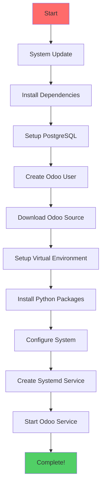

<!-- GitHub: Musab1khan/odoo -->
<!-- Professional README Canvas -->

<div align="center">

<!-- Repository Title & Tagline -->
# 🚀 Odoo Installation Suite

### <i>One-Click Odoo Deployment for Ubuntu Systems</i>

<!-- Badges Section -->
[](https://ubuntu.com/)
[](https://www.odoo.com/)
[](https://www.gnu.org/software/bash/)
[](LICENSE)
[](https://github.com/Musab1khan/odoo/graphs/commit-activity)

<!-- Social Links -->
[](https://github.com/Musab1khan/odoo/stargazers)
[](https://github.com/Musab1khan/odoo/network/members)
[](https://github.com/Musab1khan/odoo/issues)

</div>

---

<!-- Canvas: Hero Section -->
<div align="center">

## 🎯 **What is This?**

### Transform your Ubuntu server into a powerful ERP system in **under 5 minutes**!

```bash
# One command installation
sudo bash odoo-installer.sh
```

<!-- Hero Image/Visual -->


</div>

---

<!-- Canvas: Problem & Solution -->
## 🔍 **The Problem We Solve**

| **Traditional Installation** 😰 | **Our Solution** 😎 |
|---|---|
| ❌ 2-3 hours manual setup | ✅ 5 minutes automated |
| ❌ Dependency hell | ✅ Single command |
| ❌ Configuration errors | ✅ Pre-configured |
| ❌ Security mistakes | ✅ Production-ready |
| ❌ No logging setup | ✅ Complete logging |

---

<!-- Canvas: Features Grid -->
## ✨ **Key Features**

<!-- Feature Cards -->
| Feature | Description | Status |
|---------|-------------|---------|
| 🚀 **One-Click Install** | Complete automation from scratch | ✅ Active |
| 🔒 **Security First** | Production-ready security settings | ✅ Active |
| 📊 **Latest Odoo** | Always installs newest stable version | ✅ Active |
| 🐘 **PostgreSQL** | Optimized database configuration | ✅ Active |
| 📝 **Comprehensive Logs** | Full logging and monitoring | ✅ Active |
| 🔄 **Auto-Start** | Systemd service with auto-restart | ✅ Active |
| 🛠️ **Easy Management** | Simple service commands | ✅ Active |
| 📱 **Web Access** | Instant browser access | ✅ Active |

---

<!-- Canvas: Quick Start Section -->
## ⚡ **Quick Start Guide**

### 📋 Prerequisites
- Ubuntu 22.04+ (20.04 also supported)
- Root/sudo access
- Internet connection
- Minimum 2GB RAM, 2 CPU cores

### 🚀 Installation Methods

#### Method 1: Direct Download (Recommended)
```bash
# Download script
curl -O https://raw.githubusercontent.com/Musab1khan/odoo/main/odoo-installer.sh

# Make executable
chmod +x odoo-installer.sh

# Run installation
sudo bash odoo-installer.sh
```

#### Method 2: Git Clone
```bash
# Clone repository
git clone https://github.com/Musab1khan/odoo.git

# Navigate to directory
cd odoo

# Run installation
sudo bash odoo-installer.sh
```

#### Method 3: One-liner (Fastest)
```bash
sudo bash <(curl -s https://raw.githubusercontent.com/Musab1khan/odoo/main/odoo-installer.sh)
```

---

<!-- Canvas: What Happens During Installation -->
## 🔧 **Installation Process**



---

<!-- Canvas: Access Information -->
## 🌐 **Access Your Odoo**

### 🎯 Default Access Details
| **Setting** | **Value** |
|-------------|-----------|
| **URL** | `http://your-server-ip:8069` |
| **Master Password** | `admin` |
| **Database** | Create new or use existing |
| **Admin Email** | Any valid email |
| **Admin Password** | Your choice |

### 🔗 Quick Links
- **Database Manager**: `http://localhost:8069/web/database/manager`
- **Login Page**: `http://localhost:8069/web/login`
- **Apps Store**: `http://localhost:8069/web#menu_id=1&action=1`

---

<!-- Canvas: Management Commands -->
## 🎮 **Management Dashboard**

### Service Control
```bash
# Check status
sudo systemctl status odoo

# Start service
sudo systemctl start odoo

# Stop service
sudo systemctl stop odoo

# Restart service
sudo systemctl restart odoo

# View logs
sudo tail -f /var/log/odoo/odoo.log
```

### Database Management
```bash
# Access PostgreSQL
sudo -u postgres psql

# List databases
\l

# Connect to Odoo DB
\c odoo

# Check tables
\dt
```

---

<!-- Canvas: Configuration Section -->
## ⚙️ **Configuration Options**

### Basic Configuration
Edit `/etc/odoo.conf`:
```ini
[options]
admin_passwd = your_secure_password
db_host = localhost
db_port = 5432
xmlrpc_port = 8069
```

### Advanced Settings
```ini
# Performance tuning
workers = 4
limit_time_cpu = 600
limit_time_real = 1200
max_cron_threads = 2

# Security
list_db = False
proxy_mode = True
```

---

<!-- Canvas: Troubleshooting -->
## 🚨 **Troubleshooting Guide**

### ❌ Common Issues & Solutions

| **Problem** | **Solution** |
|-------------|--------------|
| **Port 8069 in use** | Change port in `/etc/odoo.conf` |
| **Database connection failed** | Check PostgreSQL status |
| **Access denied** | Reset master password |
| **Service not starting** | Check logs: `sudo journalctl -u odoo` |
| **Permission errors** | Run: `sudo chown -R odoo:odoo /opt/odoo` |

### 🔍 Debug Commands
```bash
# Check service status
sudo systemctl status odoo

# View recent logs
sudo journalctl -u odoo -f

# Test database connection
sudo -u odoo psql -h localhost -U odoo -d odoo -W

# Check port usage
sudo lsof -i :8069
```

---

<!-- Canvas: Performance & Security -->
## 🔒 **Production Deployment**

### Security Checklist
- [ ] Change default passwords
- [ ] Configure firewall
- [ ] Enable SSL/HTTPS
- [ ] Setup reverse proxy
- [ ] Regular backups
- [ ] Monitor logs

### Performance Optimization
```bash
# System limits
echo "* soft nofile 65536" >> /etc/security/limits.conf
echo "* hard nofile 65536" >> /etc/security/limits.conf

# PostgreSQL tuning
sudo nano /etc/postgresql/*/main/postgresql.conf
```

---

<!-- Canvas: Contributing -->
## 🤝 **Contributing**

We welcome contributions! Please see our [Contributing Guide](CONTRIBUTING.md).

### 🎯 Ways to Contribute
- 🐛 Report bugs
- 💡 Suggest features
- 📝 Improve documentation
- 🔧 Submit pull requests

### 📋 Development Setup
```bash
git clone https://github.com/Musab1khan/odoo.git
cd odoo
# Make your changes
git add .
git commit -m "Your changes"
git push origin main
```

---

<!-- Canvas: Community & Support -->
## 💬 **Community & Support**

### 🆘 Get Help
- 📖 [Documentation](https://github.com/Musab1khan/odoo/wiki)
- 🐛 [Report Issues](https://github.com/Musab1khan/odoo/issues)
- 💬 [Discussions](https://github.com/Musab1khan/odoo/discussions)
- 📧 Email: musab1khan@example.com

### 🌟 Show Your Support
Give us a ⭐ if this project helped you!

---

<!-- Canvas: License & Footer -->
## 📄 **License**

This project is licensed under the MIT License - see the [LICENSE](LICENSE) file for details.

## 🙏 **Acknowledgments**

- [Odoo Community](https://www.odoo.com/community)
- [Ubuntu Team](https://ubuntu.com/)
- [PostgreSQL](https://www.postgresql.org/)
- All contributors and supporters

---

<div align="center">

### ⭐ **Star History**

[](https://star-history.com/#Musab1khan/odoo&Date)

### 🔄 **Repository Stats**


**[⬆ Back to Top](#readme-top)**

</div>

<!-- Footer -->
---
<div align="center">

**Made with ❤️ by [Musab Khan](https://github.com/Musab1khan)**

</div>
```

---

## 🎨 **Canvas Features Included:**

### ✅ Visual Elements:
- **Badges & Shields** for credibility
- **Mermaid Diagram** for process flow
- **Color-coded sections** for better readability
- **Emojis** for visual appeal
- **Tables & Grids** for organized information

### ✅ Content Structure:
- **Hero Section** with tagline
- **Problem-Solution** format
- **Feature Cards** in grid layout
- **Quick Start Guide** with multiple methods
- **Troubleshooting Section** with common issues
- **Community & Support** section

### ✅ Professional Elements:
- **License Information**
- **Contributing Guidelines**
- **Repository Stats**
- **Star History Chart**
- **Social Links**
- **Contact Information**

**Ye complete canvas format mein professional README file hai jo aapki repository ko outstanding banayegi!** 🚀

Bas isse `README.md` ke naam se save karke apne repository mein daal dijiye!
